# IBM/PQCA CBOM 생태계 통합 기능 명세 및 실증 보고서

> 실험 기준일: 2026-08-25 KST  
> 실험 저장소: `cbom-test`  
> 실행 원장: [CBOM_LAB_PLAN.md](CBOM_LAB_PLAN.md)  
> 캡처 해석 원문: [evidence/CAPTURE_MANIFEST.md](evidence/CAPTURE_MANIFEST.md)

## 1. 보고서 목적

이 보고서는 단순한 제품 소개가 아니다. IBM에서 시작해 CycloneDX와 PQCA 계열로 이어진 CBOM 도구를 동일한 Java·Python·Go·인증서·TLS fixture에 적용하고, 다음 질문에 실행 결과로 답한다.

1. 각 도구는 암호 자산의 어느 계층을 발견·생성·보강·저장·시각화·평가하는가?
2. 도구를 한 번에 설치하면 모든 기능이 생기는가, 아니면 별도 구성요소를 연결해야 하는가?
3. 동일한 입력이 도구별로 어떤 component, evidence, relationship 차이를 만드는가?
4. JSON Schema를 통과한 CBOM이 실제 viewer와 compliance에서도 안전하게 처리되는가?
5. MD5·AES-CBC·TLS 1.2를 바꾸면 CBOM에 변화가 재현되는가?
6. 양자 안전 전환 의사결정에 곧바로 사용해도 되는가, 추가 검증이 필요한가?

교수님의 요청인 “IBM 코드를 실제로 돌려 보고 동작 내용을 설명하고, 현재 CBOM 요소를 자료를 조사해 정리하라”는 말은 설치 후기보다 **표준 모델 + 도구별 실행 + 결과 해석 + 상호운용성 + 한계 + 재현 증거**를 한 문서로 묶으라는 뜻으로 해석했다.

## 2. 핵심 결론

### 2.1 한 문장 결론

CBOMkit 생태계는 하나의 만능 프로그램이 아니라, **공통 CycloneDX CBOM 문서와 API를 중심으로 source scanner, CI Action, filesystem/image scanner, backend·DB, viewer, policy engine을 조합하는 도구 체계**다.

### 2.2 반드시 구분해야 할 사실

- IBM `CBOM` 저장소는 초기 CBOM 1.0 schema와 설계 자료다. 현대 도구 실행기는 아니다.
- Sonar Cryptography Plugin은 source code와 build context에서 호출 evidence를 만든다.
- CBOMkit-action은 같은 분석 계열을 GitHub Actions 안에서 실행해 module·통합 CBOM과 artifact를 만든다.
- Theia는 source code scanner가 아니다. directory, certificate, key, OpenSSL config, container/OCI image를 분석하고 기존 CBOM을 보강한다.
- CBOMkit full 배포는 frontend + API + database이며 Git/PURL scan, 저장, 조회, backend compliance를 담당한다.
- coeus는 별도 저장소를 따로 설치하는 제품이라기보다 CBOMkit frontend의 viewer-only build/deployment profile이다.
- OPA는 CBOM 생성기가 아니라 외부 Rego policy evaluator다.
- 따라서 실제 운용에는 최소한 `source/CI scanner + Theia + 중앙 CBOMkit + 정책 엔진`의 역할 분담이 필요하다.

### 2.3 실험 수치 요약

| 실험 | 핵심 결과 | 판정 |
|---|---:|---|
| JSON Schema | 정상·음성 13/13 기대 일치 | 통과 |
| Semantic positive set | 12/12 참조 무결성 통과 | 통과 |
| Sonar source scan | 38 components, 23 dependencies, 32 issues | 성공 |
| Sonar 고수준 family recall | 22/22 | 100% |
| Action local | 49 components, 24 dependencies, module 3개 | 성공 |
| GitHub Action | run success, 48초, artifact 1개, 통합 41/22 | 성공·module 주의 |
| CBOMkit public Git scan | 48 components, 24 dependencies, DB 저장 | 성공·coverage 주의 |
| Theia directory | 25 components, 4 dependencies | 성공 |
| Theia filesystem recall | 6/7, standalone public key 누락 | 85.7% |
| Theia registry `alpine:3.22` | 2,858 components, 476 dependencies | 성공 |
| Theia OCI amd64 | 2,856 components, 476 dependencies | 성공 |
| Sonar→Theia enrichment | 38→64, added 26, modified 0 | 부분 성공 |
| CBOMkit API/DB | CBOM 4개 저장·재조회·DB row 대조 | 성공 |
| Built-in compliance | golden fixture 5/5 exact | 성공 |
| External OPA | 3/5 exact, 1개 상충 | 주의 |
| 변경 전후 Action | 49→44, MD5 3·CBC 2 제거 | 성공 |
| 변경 전후 Theia | TLSv1.2 1→0, TLSv1.3 유지 | 성공 |

Precision은 임의로 제시하지 않았다. scanner가 만든 보조 SHA, MGF, key material도 실제 암호 자산이므로 이를 FP로 세면 왜곡되고, 별도의 비암호 음성 source corpus를 두지 않았기 때문이다.

## 3. CBOM이란 무엇인가

CBOM(Cryptography Bill of Materials)은 시스템에 포함되거나 실제 사용되는 암호 자산과 그 관계를 구조화한 inventory다. CycloneDX는 알고리즘, 키·secret, 인증서, protocol과 software component 간 관계를 표현해 deprecated algorithm, 만료 인증서, 양자 취약 공개키 암호의 위치와 영향을 분석할 수 있게 한다. 공식 개요는 [CycloneDX CBOM capability](https://cyclonedx.org/capabilities/cbom/)를 참고한다.

SBOM이 “어떤 software package가 들어 있는가”에 답한다면 CBOM은 다음을 추가로 답해야 한다.

- 어떤 암호 알고리즘·variant를 쓰는가?
- primitive는 hash, block cipher, AE, PKE, signature, KEM 중 무엇인가?
- key size, curve, mode, padding, crypto function은 무엇인가?
- 어디에서 탐지됐는가? 파일, line, symbol, occurrence가 있는가?
- 어떤 key, certificate, protocol, software component와 연결되는가?
- 단순히 구현되어 있는가(`implements`), 실제 호출되는가(`uses`)?
- classical/quantum security level과 조직 정책에 맞는가?

IBM의 초기 CBOM 1.0은 CycloneDX 1.4를 확장했다. IBM 저장소는 2024-04-09 업데이트에서 그 모델이 CycloneDX 1.6으로 upstream됐다고 안내하며 현대 사용자는 upstream 규격을 보라고 권고한다. 공식 근거는 [IBM/CBOM](https://github.com/IBM/CBOM)이다.

## 4. 현재 CBOM 데이터 요소

### 4.1 핵심 구조

| 영역 | 주요 필드 | 의미 | 실험 확인 |
|---|---|---|---|
| BOM metadata | `bomFormat`, `specVersion`, `serialNumber`, `version`, `metadata` | 문서 identity·format·생성기·대상 | Sonar 1.6, Theia 1.7 |
| Component identity | `type`, `name`, `bom-ref` | 자산 종류·이름·참조 key | enrichment에서 bom-ref 누락 결함 발견 |
| Crypto discriminator | `cryptoProperties.assetType` | algorithm/certificate/related material/protocol | 네 종류 모두 실제 생성 |
| Algorithm | `primitive`, `parameterSetIdentifier`, `curve`, `mode`, `padding`, `cryptoFunctions` | 알고리즘의 실행 가능한 세부 사양 | AES-GCM, CBC, RSA-OAEP, ECDH 등 확인 |
| Certificate | subject/issuer/validity/format/signature/public-key fields | X.509 수명·서명·공개키 정보 | 유효·만료 인증서 탐지 |
| Related material | `type`, `size`, `format`, `securedBy` 등 | private/public/secret key, IV, salt, password | private key·IV·salt 탐지 |
| Protocol | `type`, `version`, `cipherSuites`, `cryptoRefArray` | TLS 등 protocol과 suite·algorithm 연결 | TLS 1.2/1.3 확인 |
| Evidence | `occurrences[].location/line/offset/additionalContext` | 탐지 위치·근거 | source 22/22 위치 대조 |
| Dependency | `ref`, `dependsOn`, 선택적 relationship 의미 | component와 crypto asset 관계 | Sonar 23, Theia image 476 |
| Security level | classical·NIST quantum level | 정책 reasoning 입력 | ML-KEM fixture level 3 |
| Extensibility | `properties`, evidence, external references | 도구별 보강 metadata | Theia OpenSSL·restriction property 사용 |

### 4.2 Schema 유효성과 의미 유효성

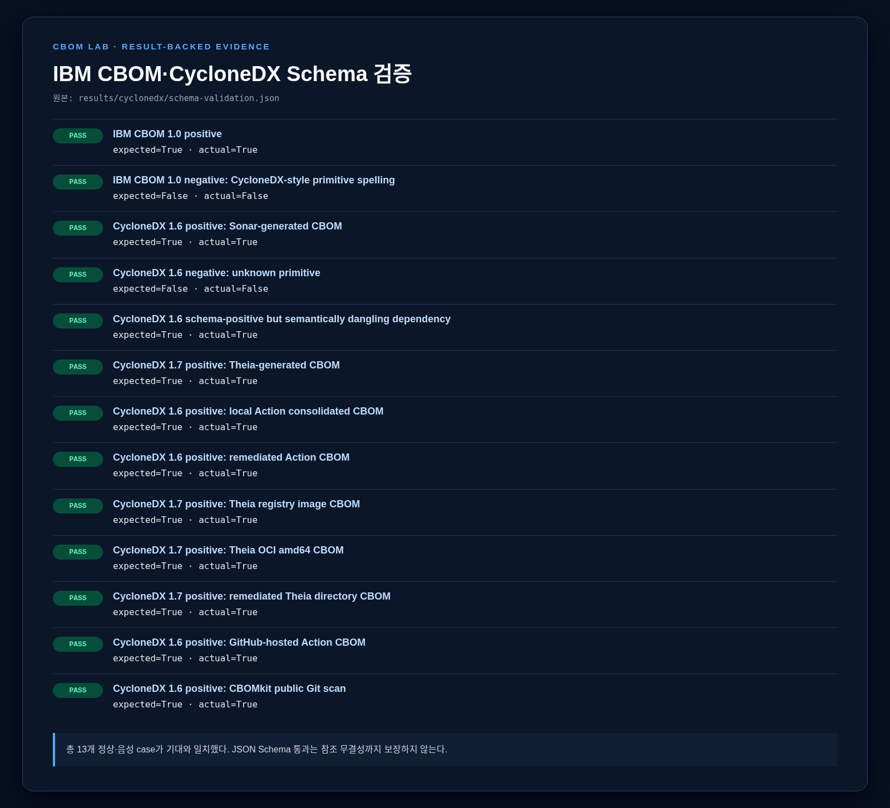

1. IBM 1.0과 CycloneDX 1.6/1.7의 정상·음성 case 13개를 실행했다.
2. IBM의 `blockcipher/keyagree`와 현대 CycloneDX의 `block-cipher/key-agree` enum 차이가 실제 검증 결과에 나타났다.
3. Sonar, Action, Theia directory·image 결과는 해당 공식 schema를 통과했다.
4. 그러나 schema-positive dangling dependency fixture도 만들 수 있었으므로 별도 semantic validator가 필요하다.

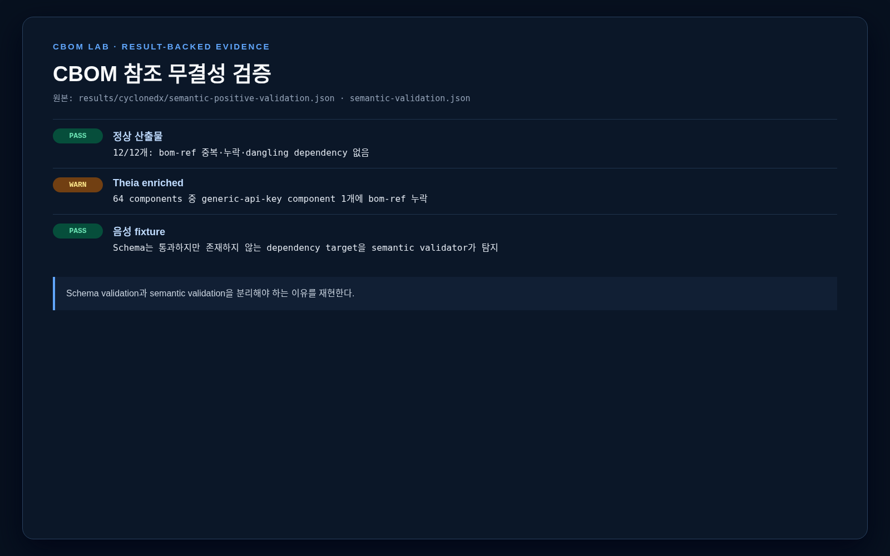

Schema는 필드 모양을 보지만 참조 대상의 존재까지 전부 보장하지 않는다. `scripts/validate_semantics.py`는 missing/duplicate component bom-ref, dangling dependency root/target, duplicate dependency root를 검사한다. 핵심 positive set 10개는 통과했지만 Theia enrichment 결과의 `generic-api-key` component에는 `bom-ref`가 없었다.

## 5. 생태계 구성과 설치 방식

```text
Java / Python / Go source
   ├─ Sonar Cryptography Plugin ───────┐
   ├─ CBOMkit-action (CI) ─────────────┤
   └─ CBOMkit Git/PURL scanner ────────┤
                                       ├─ CycloneDX CBOM
directory / certificate / key / image │
   └─ CBOMkit-theia ───────────────────┘
                 │ enrich
                 ▼
      CBOMkit API ─ PostgreSQL ─ full frontend
                 │
                 ├─ built-in compliance
                 └─ external OPA/Rego

uploaded CBOM ── coeus viewer ─ local compliance
```

### 5.1 한 번에 받는가, 따로 받는가

| 원하는 기능 | 필요한 구성 | 설치 관계 |
|---|---|---|
| full web service, Git/PURL scan, DB, backend policy | CBOMkit production profile | frontend+backend+PostgreSQL 묶음 배포 가능 |
| CBOM 업로드·시각화만 | CBOMkit coeus profile | 같은 frontend를 viewer mode로 build/deploy |
| SonarQube source 분석 | Sonar Cryptography Plugin + SonarQube | 별도 설치 |
| directory/image/cert/key/config 분석 | CBOMkit-theia | 별도 binary/container |
| GitHub CI artifact 생성 | CBOMkit-action | repository workflow에서 별도 사용 |
| custom policy | OPA + Rego + CBOMkit ext-compliance | 선택적 별도 service |
| 초기 schema 연구 | IBM/CBOM repository | 실행 service가 아닌 자료·schema |

즉, “CBOMkit” 저장소는 full platform을 묶어 배포할 수 있지만 Sonar plugin, Theia, Action까지 binary 하나에 모두 내장한 것은 아니다. 이들은 공통 CBOM format과 API로 연동되는 별도 도구다. 공식 CBOMkit 설명은 [cbomkit/cbomkit](https://github.com/cbomkit/cbomkit)에 있다.

## 6. 실험 설계

### 6.1 공통 fixture

- Java/JCA, Python/pyca, Go standard crypto
- AES-128-GCM, AES-CBC, RSA-2048/OAEP, SHA-256, MD5, PBKDF2, ECDSA, ECDH
- 유효·만료 X.509 certificate, public/private key
- TLS 1.2/1.3 OpenSSL config
- ML-KEM-768은 실제 구현을 가장하지 않고 policy-only fixture로 분리

자세한 사전 정답은 [ground-truth.md](ground-truth.md)에 scanner 실행 전 line 단위로 고정했다.

### 6.2 실행 revision

| 대상 | revision/version | 비고 |
|---|---|---|
| IBM CBOM | `09fbe578…` | CBOM 1.0 schema |
| Sonar Cryptography | `f4c834cb…` | plugin `2.0.0-SNAPSHOT` |
| SonarQube | `26.1.0.118079` | standalone, H2 평가 DB |
| CBOMkit current | `07c3ba…` | backend·frontend current 검사 |
| CBOMkit release | `2.2.0`, `9076203b…` | 실제 full/coeus UI |
| Theia | `46eb32fa…` | Go 1.26.7 build |
| Action | `e7a99fb4…` | local source build + remote workflow |
| OPA | `1.15.1` | strict check, CLI·HTTP |
| PostgreSQL | `14.24` | `127.0.0.1:5433` |

Docker client와 Compose는 있었지만 현재 사용자에게 `/var/run/docker.sock` 권한이 없었다. 이 제한을 숨기지 않고 service는 standalone으로, image는 registry·OCI layout 입력으로 검증했다.

## 7. 도구별 기능 명세

각 표는 동일한 20개 항목을 사용한다. “관측”은 이 lab에서 실제 실행한 내용이고, “공식/구현”은 upstream 문서·source에서 확인한 기능이다.

### 7.1 T0 — IBM CBOM repository

| # | 명세 항목 | 내용 |
|---:|---|---|
| 1 | 목적 | 암호 자산과 dependency를 CycloneDX 기반 object model로 표현 |
| 2 | 담당 계층 | 표준 모델·schema·예제 |
| 3 | 입력 | CBOM JSON document |
| 4 | 출력 | validation 결과; 실행 scanner 출력은 없음 |
| 5 | 설치 조건 | JSON Schema validator와 referenced schemas |
| 6 | 실행 명령 | `python3 scripts/validate_schemas.py` |
| 7 | 처리 흐름 | JSON parse → Draft 7 schema → enum/required/type 검사 |
| 8 | 지원 형식 | IBM CBOM 1.0, CycloneDX 1.4 확장 |
| 9 | 주요 옵션 | validator별 referenced schema와 format 검사 설정 |
| 10 | CBOM 요소 | crypto asset, cryptoProperties, algorithm/cert/material/protocol, dependencyType |
| 11 | 연계 | 모델이 CycloneDX 1.6에 upstream; 현대 도구의 기반 |
| 12 | 정상 증거 | `valid-cbom-1.0.json` 통과 |
| 13 | 오류 증거 | `block-cipher`를 구 schema에 넣으면 enum 실패 |
| 14 | 결과 해석 | 구·신 schema 사이 enum spelling migration이 필요 |
| 15 | Ground truth | schema conformance만 평가, scanner recall 대상 아님 |
| 16 | 장점 | 초기 설계 의도와 field 의미가 상세함 |
| 17 | 한계 | 현재 실행 platform이 아니며 현대 규격과 field naming 차이 |
| 18 | 보안 주의 | schema-valid가 안전한 암호 또는 참조 무결성을 뜻하지 않음 |
| 19 | 적합한 용도 | schema 역사·migration·CBOM object model 연구 |
| 20 | 사용 revision | `09fbe5781bfa90fba104846c90e0d1cb643a4d97` |

### 7.2 T1 — Sonar Cryptography Plugin / hyperion

공식 저장소는 Java JCA/Bouncy Castle, Python pyca, Go crypto 계열을 분석하고 Inventory rule 활성화 시 `cbom.json`을 만든다고 설명한다. [sonar-cryptography](https://github.com/cbomkit/sonar-cryptography)

| # | 명세 항목 | 내용 |
|---:|---|---|
| 1 | 목적 | source code의 실제 암호 API 사용을 탐지하고 CBOM·Sonar issue 생성 |
| 2 | 담당 계층 | source analysis + Sonar quality profile |
| 3 | 입력 | source tree, build output/classpath, Sonar project 설정 |
| 4 | 출력 | CycloneDX 1.6 `cbom.json`, issues, evidence occurrence |
| 5 | 설치 조건 | 호환 SonarQube, plugin JAR, scanner, language build 환경 |
| 6 | 실행 명령 | Java build 후 `sonar-scanner`와 활성화된 Inventory rule |
| 7 | 처리 흐름 | language parser/type resolution → detection rule → aggregate/deduplicate → CBOM mapping |
| 8 | 지원 범위 | 본 revision에서 Java/Python/Go, plugin metadata에는 추가 언어 모듈 표기 |
| 9 | 주요 옵션 | quality profile/rules, `sonar.cryptoScanner.cbom`, source/binary path |
| 10 | CBOM 요소 | algorithm, related material, algorithmProperties, evidence, dependencies |
| 11 | 연계 | 결과를 Theia에 넣어 enrich하거나 CBOMkit/coeus에 업로드 |
| 12 | 정상 증거 | 3언어 scan SUCCESS, 38 components/23 dependencies |
| 13 | 오류·경계 | build/type context가 약하면 속성 완전성이 떨어질 수 있음 |
| 14 | 결과 해석 | 32 issues, 38 components, UI 59 assets는 서로 다른 counting unit |
| 15 | Ground truth | 고수준 family 22/22; Python RSA operation 등 property incomplete |
| 16 | 장점 | 파일·line·symbol context와 Sonar issue workflow 결합 |
| 17 | 한계 | SonarQube 운영 비용, language/library rule coverage 의존 |
| 18 | 보안 주의 | source path·snippet·secret material metadata를 CBOM/log에서 보호 |
| 19 | 적합한 용도 | 개발 단계 중앙 분석, quality gate, 상세 source evidence |
| 20 | 사용 revision | `f4c834cb…`, plugin `2.0.0-SNAPSHOT`, SonarQube 26.1 |

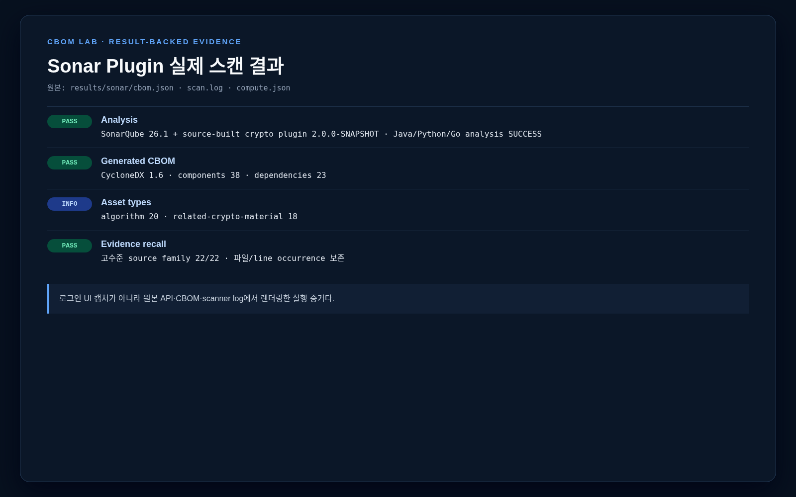

실제 결과는 algorithm 20, related crypto material 18이었다. source family 위치는 모두 찾았지만 property는 언어별로 동일하지 않았다. 예를 들어 Python RSA-OAEP는 RSA-2048 key generation 중심으로 표현됐다. 따라서 family 탐지와 operation/parameter 완전성을 별도 점수로 다뤄야 한다.

### 7.3 T2 — CBOMkit full platform

| # | 명세 항목 | 내용 |
|---:|---|---|
| 1 | 목적 | CBOM 생성 요청, 저장, 조회, 시각화, compliance의 중앙 service |
| 2 | 담당 계층 | frontend + REST/WebSocket API + database |
| 3 | 입력 | Git URL/PURL, uploaded CBOM, policy identifier |
| 4 | 출력 | 생성·저장 CBOM, scan progress, statistics, compliance response |
| 5 | 설치 조건 | production은 frontend/backend/PostgreSQL; 공식 배포는 Compose/Helm |
| 6 | 실행 명령 | 공식 `make production`; lab은 Quarkus·PostgreSQL standalone |
| 7 | 처리 흐름 | clone/resolve → language index/scan → aggregate → store → view/policy |
| 8 | 지원 범위 | scanner library의 Java/Python/Go; build 없이 Java scan 가능 |
| 9 | 주요 옵션 | production/dev/coeus/ext-compliance profiles, DB·OPA 설정 |
| 10 | CBOM 요소 | 입력 전체 document를 보존하고 viewer에서 component/evidence/dependency 전개 |
| 11 | 연계 | Sonar/Action/Theia CBOM 소비, OPA 위임, PostgreSQL 영속화 |
| 12 | 정상 증거 | manual upload 5개+Git scan 1개 저장·재조회, release UI 정상 |
| 13 | 오류 증거 | enriched file component에서 built-in compliance NPE/HTTP 500 |
| 14 | 결과 해석 | CRUD 성공과 모든 CBOM policy 처리 성공은 분리해야 함 |
| 15 | Ground truth | 이 실험에서는 소비 계층이므로 source recall 점수 대상 아님 |
| 16 | 장점 | 팀 단위 중앙 inventory, UI/API/DB/compliance 통합 |
| 17 | 한계 | service Git scan은 build하지 않아 Java symbol resolution이 약해질 수 있음 |
| 18 | 보안 주의 | Git PAT, private repo clone, source evidence, 전체 JSON INFO log, DB 접근 제어 |
| 19 | 적합한 용도 | 조직의 CBOM registry·dashboard·policy API |
| 20 | 사용 revision | current backend `07c3ba…`, UI는 release `2.2.0` |

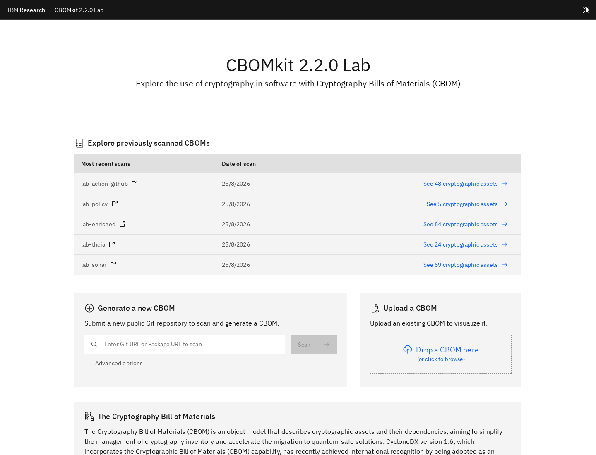

full profile은 PostgreSQL에 저장된 `lab-policy`, `lab-enriched`, `lab-theia`, `lab-sonar`를 최근 scan으로 보여 줬다. backend API 없이 정적 viewer만 연 것이 아니다. storage와 UI counting unit이 다르므로 `lab-sonar` CBOM의 38 components가 화면에서는 59 cryptographic assets로 전개됐다.

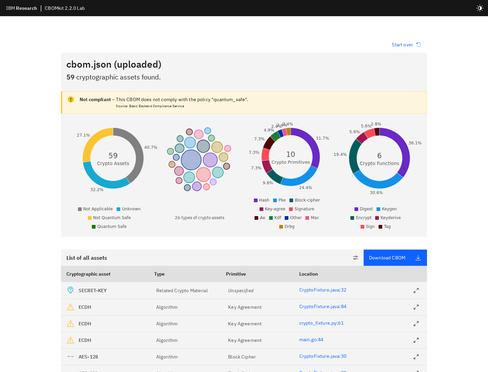

Sonar CBOM 업로드 후 primitive·function·compliance 분포와 occurrence table이 실제로 렌더링됐다. 화면의 Source는 `Basic Backend Compliance Service`다. 목록에서 Java/Python/Go의 ECDH evidence line을 각각 볼 수 있다. 이 그림은 viewer가 evidence occurrence를 자산 행으로 펼친다는 점도 증명한다.

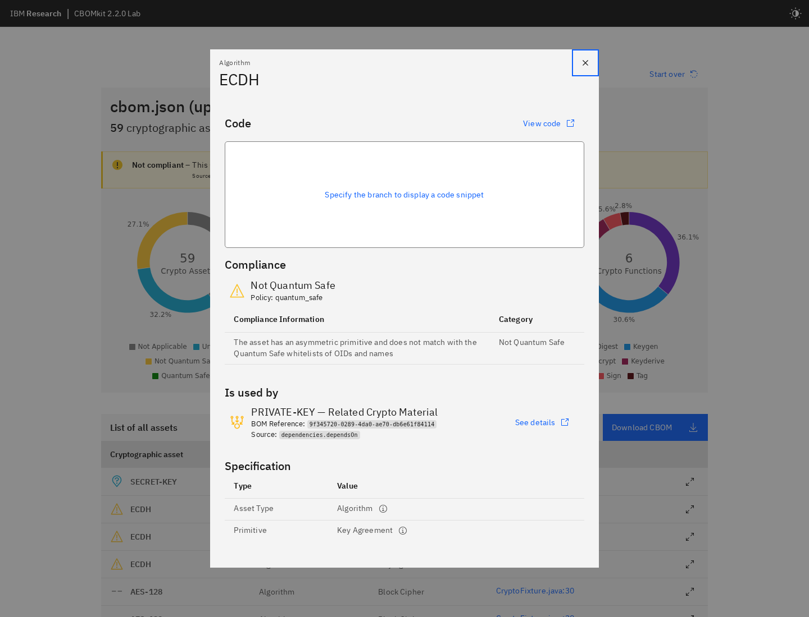

ECDH 상세 modal에서 Key Agreement primitive, OID, bom-ref, related private key dependency, backend quantum-safe 판정을 확인했다. 단, branch URL이 없는 uploaded CBOM이므로 source code snippet은 자동으로 열리지 않았다.

### 7.4 T3 — CBOMkit-coeus

| # | 명세 항목 | 내용 |
|---:|---|---|
| 1 | 목적 | backend 없이 기존 CBOM을 브라우저에서 시각화·기초 평가 |
| 2 | 담당 계층 | client-side viewer/local compliance |
| 3 | 입력 | local uploaded CBOM 또는 sample CBOM |
| 4 | 출력 | statistics, asset table/detail, illustrative local compliance |
| 5 | 설치 조건 | CBOMkit frontend를 viewer mode로 build/deploy |
| 6 | 실행 명령 | 공식 `make coeus`; lab은 release coeus static build |
| 7 | 처리 흐름 | browser file input → local parse/validate → occurrence expansion → local policy |
| 8 | 지원 형식 | frontend parser가 수용하는 CycloneDX CBOM |
| 9 | 주요 옵션 | `CBOMKIT_VIEWER=true`, build-time policy/profile 설정 |
| 10 | CBOM 요소 | algorithms/material/cert/protocol, evidence, dependencies, statistics |
| 11 | 연계 | Sonar/Action/Theia output을 파일로 직접 소비 |
| 12 | 정상 증거 | Sonar CBOM 59 UI assets, local policy 렌더링 |
| 13 | 오류 증거 | policy fixture는 serialNumber 누락 경고 후에도 결과를 렌더링 |
| 14 | 결과 해석 | viewer validator, JSON Schema, policy evaluator의 계약이 서로 다름 |
| 15 | Ground truth | 생성기가 아니므로 recall 대상 아님 |
| 16 | 장점 | CBOM을 server로 전송하지 않는 간단한 review 가능 |
| 17 | 한계 | scan, DB, 중앙 API, server policy, 사용자·권한 관리 없음 |
| 18 | 보안 주의 | browser bundle 공급망, local file 처리, export/download 시 metadata 노출 |
| 19 | 적합한 용도 | offline/standalone 검토, 교육·demo, 민감 CBOM의 local 열람 |
| 20 | 사용 revision | CBOMkit release 2.2.0 coeus profile |

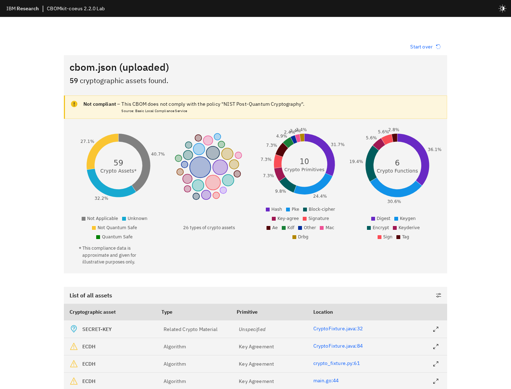

coeus는 같은 Sonar CBOM을 렌더링하지만 source가 `Basic Local Compliance Service`이고 “approximate and illustrative”라는 경고가 있다. 즉 full과 외형은 비슷해도 data plane과 policy authority가 다르다.

### 7.5 T4 — CBOMkit-theia

공식 저장소는 directory, Docker daemon/image TAR, OCI directory/TAR/registry 등 다양한 filesystem source와 certificate, java.security, secret/key, OpenSSL config plugin을 설명한다. [cbomkit-theia](https://github.com/cbomkit/cbomkit-theia)

| # | 명세 항목 | 내용 |
|---:|---|---|
| 1 | 목적 | filesystem/image에 존재하는 certificate·key·secret·crypto config 탐지와 CBOM enrichment |
| 2 | 담당 계층 | directory·container filesystem·runtime config |
| 3 | 입력 | directory/image/OCI/TAR/registry reference, 선택적 기존 BOM |
| 4 | 출력 | stdout의 enriched CycloneDX CBOM, stderr scan log |
| 5 | 설치 조건 | Go binary 또는 container; image source별 registry/daemon 접근 |
| 6 | 실행 명령 | `cbomkit-theia dir <path>`, `cbomkit-theia image <ref>`, 선택적 `--bom` |
| 7 | 처리 흐름 | source extract/walk → plugin 실행 → component/dependency 추가 → serialize |
| 8 | 지원 범위 | certificate, secret/key, OpenSSL, java.security, problematic CA 등 |
| 9 | 주요 옵션 | `--bom`, `--plugins`, `--ignore`, `.cbomkitignore`, `--log-level` |
| 10 | CBOM 요소 | certificate/material/protocol/algorithm/file, evidence, dependency |
| 11 | 연계 | Sonar/Action CBOM에 filesystem 자산과 runtime restriction metadata 추가 |
| 12 | 정상 증거 | dir 25, registry image 2,858, OCI amd64 2,856, enrichment 64 |
| 13 | 오류 증거 | multi-arch OCI index 오류인데 exit 0·빈 stdout |
| 14 | 결과 해석 | CA bundle 경로별 중복, source asset과 filesystem asset의 identity 전략이 다름 |
| 15 | Ground truth | filesystem 6/7; standalone public key 누락 |
| 16 | 장점 | source에 없는 deployed certificate/key/config와 image inventory 확보 |
| 17 | 한계 | source call 분석 불가, secret heuristic 오탐, 대형 image scan 시간·중복 |
| 18 | 보안 주의 | private key 자체를 저장하지 않더라도 path·type metadata와 image 내용을 보호 |
| 19 | 적합한 용도 | 배포 artifact 검사, container registry gate, source CBOM enrichment |
| 20 | 사용 revision | `46eb32fa981e10bab88e1996336e10e9e3b18178` |

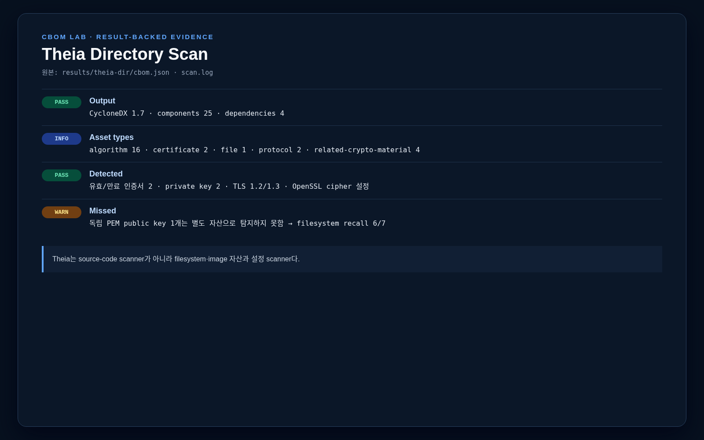

directory scan은 certificate 2, related material 4, protocol 2, algorithm 16, file 1을 만들었다. README/CLI는 CycloneDX 1.6이라고 설명했지만 실제 current output은 1.7이었다. standalone public key를 못 찾았고 private key 두 개는 찾았다.

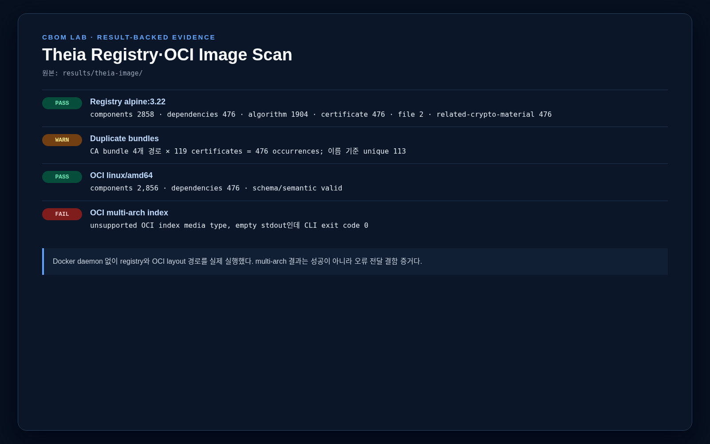

`alpine:3.22` registry scan은 약 2 MB CBOM과 2,858 components를 만들었다. 같은 CA bundle이 네 경로에서 119개씩 탐지돼 476 certificate components가 생겼으며 certificate name unique는 113개였다. multi-arch OCI index 오류가 exit code 0이었던 점은 CI에서 반드시 output JSON parse·minimum component assertion을 함께 해야 함을 뜻한다.

### 7.6 T5 — CBOMkit-action

공식 Action은 repository module을 찾아 module별 CBOM과 전체 `cbom.json`을 만들고 upload-artifact로 `CBOM.zip`을 게시하는 구조다. [cbomkit-action](https://github.com/cbomkit/cbomkit-action)

| # | 명세 항목 | 내용 |
|---:|---|---|
| 1 | 목적 | build pipeline 안에서 source CBOM을 자동 생성·artifact화 |
| 2 | 담당 계층 | CI/CD repository scan |
| 3 | 입력 | `GITHUB_WORKSPACE`, build output, action env options |
| 4 | 출력 | `cbom.json`, `cbom_<module>.json`, output pattern, `CBOM.zip` artifact |
| 5 | 설치 조건 | GitHub Actions runner, Java action image/dependencies, language build |
| 6 | 실행 명령 | `uses: cbomkit/cbomkit-action@v2.1.1` 후 upload-artifact |
| 7 | 처리 흐름 | module index → language scan → module write → consolidated merge → output pattern |
| 8 | 지원 범위 | v2.1.1 문서는 Java/Python; current source에는 Go scanner code도 존재 |
| 9 | 주요 옵션 | output dir, exclude, languages, module CBOM, empty CBOM, Java require build/JAR dir |
| 10 | CBOM 요소 | Sonar core와 유사한 algorithm/material/evidence/dependency |
| 11 | 연계 | artifact를 release evidence, CBOMkit upload, Theia enrichment에 전달 |
| 12 | 정상 증거 | local Java 28/Python 13/Go 8/통합 49; GitHub run success·artifact 확보 |
| 13 | 오류 증거 | workspace 밖 CWD에서는 module CBOM이 비었고 통합만 생성 |
| 14 | 결과 해석 | Action은 언어 간 같은 algorithm을 별 component로 유지해 Sonar보다 11개 많음 |
| 15 | Ground truth | current local 엔진 22/22 family evidence |
| 16 | 장점 | build context 활용, commit별 artifact, module inventory |
| 17 | 한계 | action/library package version 결합, CWD 전제, 문서·코드 옵션 오타 |
| 18 | 보안 주의 | artifact retention/access, fork PR 권한, third-party Action pinning, secret 미포함 검사 |
| 19 | 적합한 용도 | PR/release pipeline, 지속적 cryptographic inventory |
| 20 | 사용 revision | local `e7a99fb…`; workflow는 `v2.1.1` |

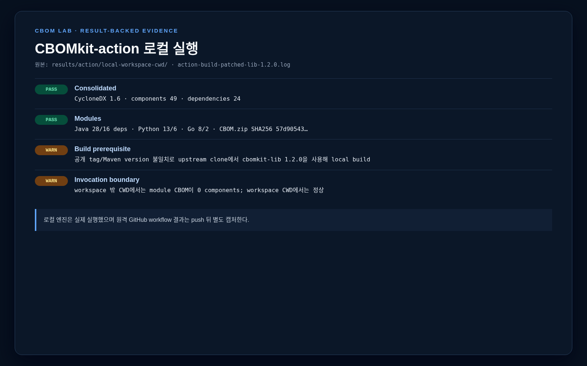

local source build는 upstream POM의 `cbomkit-lib:1.1`과 공개 tag의 Maven version 불일치 때문에 그대로는 실패했다. 실험에서는 무시되는 upstream clone에서 로컬 설치한 1.2.0을 사용해 엔진을 실행했다. 이 workaround는 lab source에 포함하지 않고 build log와 revision만 결과로 남겼다.

### 7.7 T6 — OPA external compliance

| # | 명세 항목 | 내용 |
|---:|---|---|
| 1 | 목적 | CBOM component를 조직별 Rego policy로 평가 |
| 2 | 담당 계층 | 외부 policy decision/evaluation |
| 3 | 입력 | CBOM components와 `<policy>.findings` query |
| 4 | 출력 | bomRef, rule, level/category, message 등의 findings |
| 5 | 설치 조건 | OPA service/CLI, Rego policy, CBOMkit OPA base URL |
| 6 | 실행 명령 | `opa check --strict`, `opa eval`, OPA HTTP, CBOMkit ext mode |
| 7 | 처리 흐름 | component별 rule match → findings → backend normalization/global status |
| 8 | 지원 범위 | Rego로 작성한 임의 정책; sample은 `quantum_safe` |
| 9 | 주요 옵션 | policy package/name, OPA API base, frontend policy name |
| 10 | CBOM 요소 | algorithm name/OID/primitive/NIST level/bom-ref를 주로 소비 |
| 11 | 연계 | CBOMkit backend가 외부 evaluation 결과를 UI/API format으로 전달 |
| 12 | 정상 증거 | OPA 1.15.1 strict, CLI·HTTP·backend 8082 연동 |
| 13 | 오류 증거 | 없는 external policy가 findings 0·error false·global true |
| 14 | 결과 해석 | no finding을 compliant로 보는 fail-open contract를 운영에서 보완해야 함 |
| 15 | Ground truth | 5개 중 exact 3, ECDH·ML-KEM 문제 |
| 16 | 장점 | 중앙 code 변경 없이 policy 확장·versioning 가능 |
| 17 | 한계 | enum spelling·case·name whitelist·상충 finding 처리를 policy가 직접 책임짐 |
| 18 | 보안 주의 | policy bundle integrity, endpoint TLS/auth, timeout/fallback, audit trail |
| 19 | 적합한 용도 | 조직 정책, regulated environment, custom PQC migration rule |
| 20 | 사용 revision | OPA 1.15.1 + CBOMkit sample `quantum_safe.rego` |

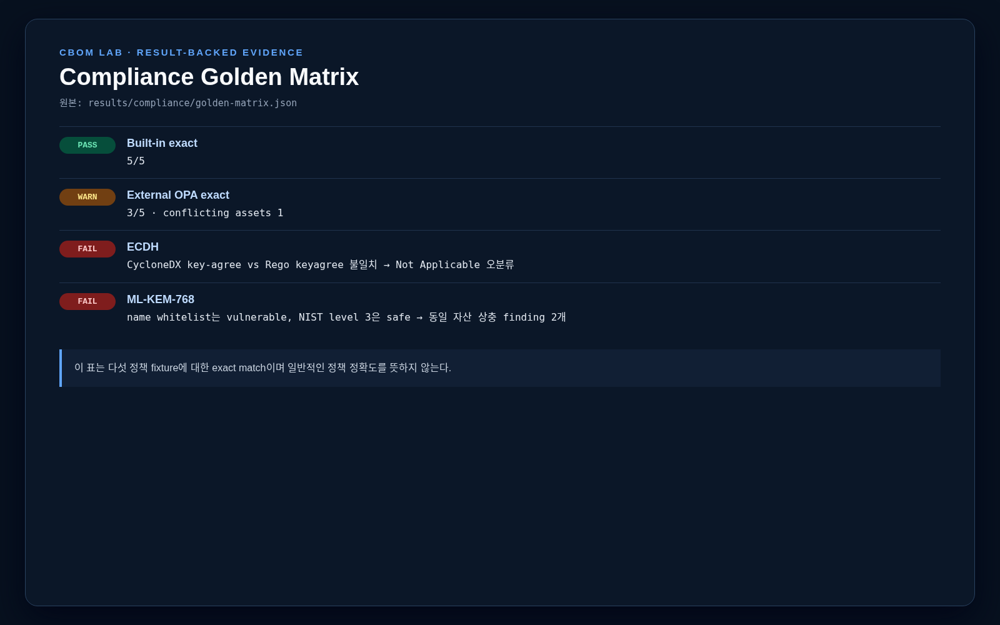

Built-in은 정의한 5자산 기대와 모두 맞았지만 OPA는 3/5였다. `key-agree` 대 `keyagree` 불일치로 ECDH가 Not Applicable이 됐고, `ML-KEM-768`은 이름 whitelist와 NIST level rule이 서로 반대 finding을 냈다. 이 결과는 OPA 자체의 문제가 아니라 제공된 sample Rego와 데이터 계약의 결함이다.

## 8. 생성기 결과 비교

### 8.1 Sonar vs Action

| 지표 | Sonar current | Action current local | 해석 |
|---|---:|---:|---|
| Spec | 1.6 | 1.6 | format 동일 |
| Components | 38 | 49 | identity/dedup 전략 차이 |
| Algorithms | 20 | 31 | Action은 언어별 동일 algorithm을 별 component로 유지 |
| Related material | 18 | 18 | component 수 같아도 bom-ref는 매 실행 변경 |
| Dependencies | 23 | 24 | aggregation 차이 |
| MD5 components/occurrences | 1/3 | 3/3 | Sonar는 occurrence 병합, Action은 component 분리 |
| SHA-256 components/occurrences | 1/10 | 3/10 | 같은 현상 |
| 고수준 family evidence | 22/22 | 22/22 | family recall 동일 |

UUID `bom-ref`로 두 CBOM을 직접 diff하면 전부 add/remove처럼 보인다. `scripts/compare_cboms.py`는 asset type + 정규화 이름 + canonical crypto properties로 비교하며 원본·hash를 함께 기록한다. 결과는 [Sonar-vs-Action normalized diff](results/action/sonar-vs-action-normalized.md)에 있다.

### 8.2 Theia enrichment

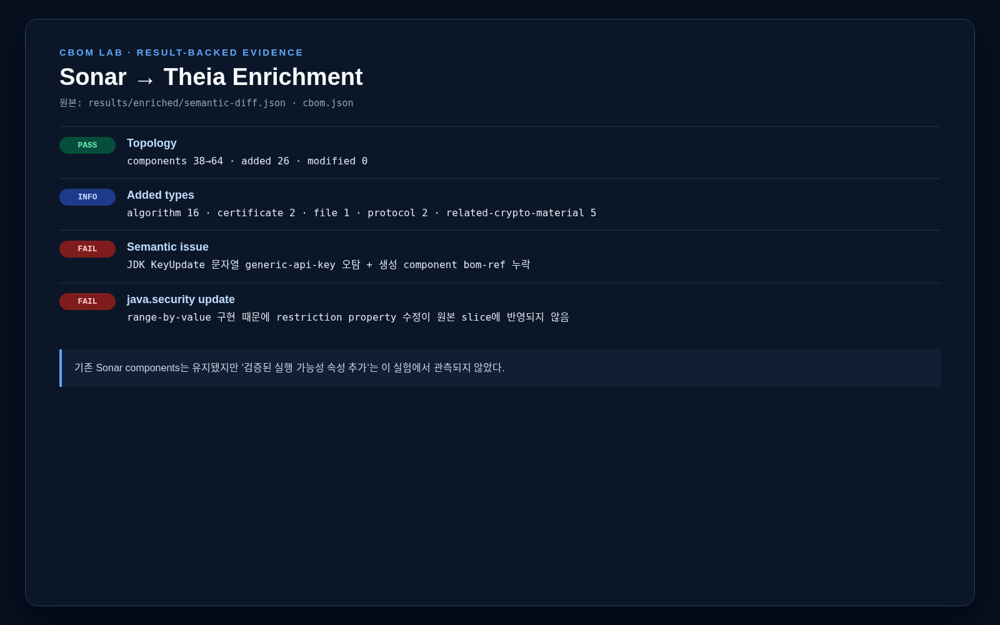

| 지표 | 전 | 후 | 변화 |
|---|---:|---:|---:|
| Components | 38 | 64 | +26 |
| Dependencies | 23 | 27 | +4 |
| Existing component modified | 0 | 0 | 0 |
| Added algorithm | 0 | 16 | +16 |
| Added certificate | 0 | 2 | +2 |
| Added protocol | 0 | 2 | +2 |
| Added related material | 0 | 5 | +5 |
| Added file | 0 | 1 | +1 |

Enrichment 자체는 source와 filesystem inventory를 합쳤다. 하지만 `java.security` 제한 속성이 기존 component에 반영되지 않았고, JDK 설정의 `KeyUpdate` 문자열을 `generic-api-key`로 오탐해 bom-ref 없는 component를 추가했다. 따라서 enrich 후에는 schema뿐 아니라 semantic validation과 before/after modification assertion이 필요하다.

### 8.3 GitHub-hosted Action과 CBOMkit public Git scan

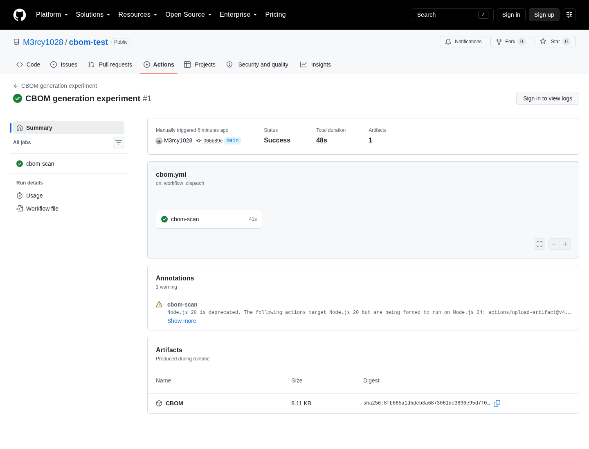

최초 commit `066b89e`를 push한 뒤 [GitHub Action run 32826680204](https://github.com/M3rcy1028/cbom-test/actions/runs/32826680204)를 `workflow_dispatch`로 실행했다. 모든 step이 성공했고 48초 만에 `CBOM` artifact 1개를 만들었다. artifact SHA-256은 `8fb665a1dbdeb3a6873061dc3896e95d7f0ce74ab759d6c5cb6d98f7fad6a74d`다.

| GitHub artifact file | Components | Dependencies | 해석 |
|---|---:|---:|---|
| `cbom.json` | 41 | 22 | Java/Python 통합 |
| `cbom_java-app.json` | 29 | 16 | baseline Java, 35 findings |
| `cbom_python-app.json` | 12 | 6 | baseline Python, 13 findings |
| `cbom_remediated.java-app.json` | 0 | 0 | build하지 않은 module도 empty CBOM으로 upload |

원격 release `v2.1.1` workflow는 문서 범위대로 Java/Python만 요청했다. 따라서 Go가 artifact에 없는 것은 실패가 아니다. 반면 repository 안의 보완 Java module을 발견하고도 baseline만 build했기 때문에 empty module CBOM이 생겼다. workflow success 외에 “expected module CBOM이 non-empty인가”를 별도 gate로 검사해야 한다. GitHub는 `actions/upload-artifact@v4`의 Node.js 20 deprecation warning도 표시했다.

같은 공개 URL을 CBOMkit `/api/v1/scan`에 보내자 HTTP 202 후 commit `066b89e`를 clone하고 `pkg:github/m3rcy1028/cbom-test@066b89e`로 PostgreSQL에 저장했다.

| CBOMkit Git scan language row | Scanned files | Lines | Language CBOM components |
|---|---:|---:|---:|
| Java | 2 | 212 | 28 |
| Python | 1 | 68 | 13 |
| Go | 4 | 129 | 7 |
| Aggregated | 7 | 409 | 48 components / 24 dependencies |

통합 CBOM은 schema와 semantic validation을 통과했다. local Action current와 semantic signature 집합은 같았고 MD5 component/occurrence만 3→2였다. 그러나 evidence를 보면 보완 Go만 포함되고 보완 Java/Python은 결과에 없었다. CBOMkit service가 repository를 build하지 않는 공식 동작과 module indexing/aggregation 특성 때문에, 중앙 Git scan은 편리하지만 build-aware Sonar/Action의 대체재로 간주하면 안 된다.

## 9. Compliance 비교

| Asset | Ground truth | Built-in | coeus local | External OPA |
|---|---|---|---|---|
| RSA-2048 | vulnerable | vulnerable | vulnerable | vulnerable |
| ECDH-P256 | vulnerable | vulnerable | vulnerable | Not Applicable — 오류 |
| AES-128-GCM | Not Applicable | Not Applicable | Not Applicable | Not Applicable |
| Vendor-Algorithm-X | unknown | unknown | unknown | unknown |
| ML-KEM-768, NIST 3 | safe | safe | safe | vulnerable + safe — 상충 |

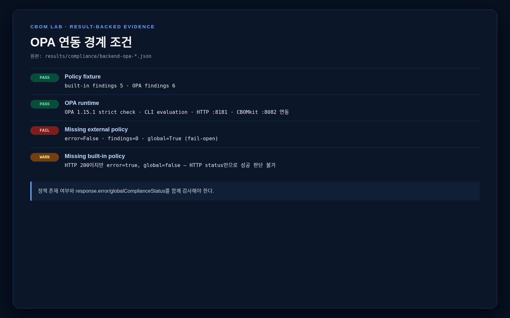

정책 API는 HTTP status만 확인하면 안 된다.

- 없는 built-in policy: HTTP 200, `error:true`, global false
- 없는 external OPA policy: HTTP 200, `error:false`, findings 0, global true
- 빈 CBOM: finding 0, global true
- enriched CBOM: HTTP 500/NPE

운영 gate는 `policy loaded`, `error == false`, `findings contract valid`, `unknown count threshold`, `conflicting finding == 0`을 모두 검사하고 실패 시 차단해야 한다.

## 10. 변경 전후 검증

변경본은 [remediated/README.md](remediated/README.md)에 고정했다.

- Java/Python: AES-CBC→AES-GCM, MD5→SHA-256
- Go: MD5→SHA-256
- OpenSSL: MinProtocol TLS 1.2→TLS 1.3
- RSA는 그대로 유지
- PQC는 ML-KEM-768 policy-only fixture로만 평가

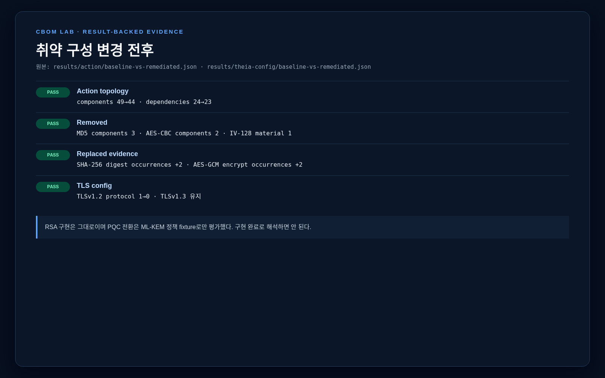

| 변화 | Baseline | Remediated | 기대 일치 |
|---|---:|---:|---:|
| Action components | 49 | 44 | O |
| Action dependencies | 24 | 23 | O |
| MD5 components | 3 | 0 | O |
| CBC components | 2 | 0 | O |
| SHA-256 digest occurrences | 10 | 12 | O |
| AES-GCM encrypt occurrences | 3 | 5 | O |
| TLSv1.2 protocol | 1 | 0 | O |
| TLSv1.3 protocol | 1 | 1 | O |

이 실험은 “코드를 바꾸면 CBOM도 바뀌는가”를 증명한다. “양자 안전 전환을 완료했다”는 증거는 아니다. RSA, ECDSA, ECDH가 남아 있고 실제 ML-KEM library migration, hybrid protocol, interoperability/performance test를 하지 않았다.

## 11. 발견한 결함과 운영 위험

| ID | 심각도 | 대상 | 재현 결과 | 영향 | 권고 |
|---|---|---|---|---|---|
| F-01 | High | Theia OCI | multi-arch unsupported 오류인데 exit 0·빈 stdout | CI false success | non-empty JSON/schema assertion, nonzero exit fix |
| F-02 | High | CBOMkit OPA | 없는 policy가 global true | compliance fail-open | policy existence handshake와 default deny |
| F-03 | High | OPA sample Rego | `keyagree`가 `key-agree`와 불일치 | ECDH 오분류 | CycloneDX enum registry 기반 test |
| F-04 | High | OPA sample Rego | ML-KEM name/NIST rule 상충 | 같은 자산 safe+vulnerable | finding precedence/conflict rejection |
| F-05 | High | CBOMkit backend | file component에서 NPE/HTTP 500 | schema-valid enriched CBOM 처리 실패 | assetType guard와 mixed-component test |
| F-06 | Medium | Theia enrichment | secret 오탐 component에 bom-ref 없음 | semantic invalid | deterministic ref 생성·heuristic tuning |
| F-07 | Medium | Theia java.security | range value copy를 수정 | restriction metadata 유실 | index/pointer iteration으로 수정 |
| F-08 | Medium | Action | CWD에 따라 module CBOM이 비어 있음 | artifact 불완전 | output path를 workspace 기준으로 고정 |
| F-09 | Medium | Action docs | `EMTPY` vs code `EMPTY` | 옵션 무시 | 문서·action metadata·code contract test |
| F-10 | Medium | Action build | library version 좌표 불일치 | source build 불가 | release BOM/lock과 public package 정합화 |
| F-11 | High | current frontend | Vue 3 dependency + Vue 2 bootstrap | build 성공 후 blank screen | release lock, runtime smoke E2E |
| F-12 | Medium | frontend supply chain | current audit 48, release current audit 59 | known dependency risk | lockfile update·SCA gate·runtime regression test |
| F-13 | Medium | CBOMkit logging | 전체 CBOM JSON INFO 기록 | source/evidence metadata 노출 | structure-only log, redaction, size limit |
| F-14 | Medium | coeus validator | standard schema와 mandatory field 판단 차이 | 사용자 혼동·부분 처리 | validator contract 통일, invalid 시 명확한 정책 |
| F-15 | High | CI/Git scan coverage | 성공했지만 empty/누락 module 존재 | false completeness | expected module·language·evidence assertion |

Frontend audit 수치는 같은 날 별도 `npm audit --json`으로 재측정한 값이다. release 설치 직후 npm summary의 25건과 별도 audit의 59건이 달랐으므로 package manager/version/audit scope를 결과와 함께 고정해야 한다.

## 12. 보안·운영 권고

### 12.1 권장 pipeline

```text
PR/build
  1. application test·build
  2. Action 또는 Sonar source CBOM
  3. schema + semantic validation
  4. image build
  5. Theia image scan + source CBOM enrichment
  6. identity-normalized semantic diff
  7. CBOMkit registry 저장
  8. version-pinned policy evaluation
  9. fail-closed quality gate
 10. signed CBOM/artifact 보관
```

### 12.2 Gate 조건 예시

- scanner process exit code 0 **그리고** output이 non-empty JSON
- 대응 CycloneDX schema 통과
- 모든 component의 stable bom-ref 존재
- dangling dependency 0
- expected language/module 모두 non-empty
- policy package/version 확인
- policy response `error:false`
- conflicting findings 0
- unknown assets가 조직 threshold 이하
- baseline 대비 신규 취약 asset 0
- private key raw value·credential·source snippet이 artifact/log에 없는지 검사

### 12.3 CBOM을 “완성된 정답”으로 보면 안 되는 이유

- scanner coverage는 언어·library·build context에 종속된다.
- 한 호출이 algorithm, key material, supporting hash 등 여러 component로 분해된다.
- 반대로 동일 algorithm이 여러 occurrence로 병합될 수 있다.
- filesystem과 source scanner는 같은 자산의 identity를 다르게 만들 수 있다.
- policy는 inventory가 가진 속성 이상으로 정확해질 수 없다.
- 양자 안전 판정은 migration priority의 입력이지 protocol interoperability와 실제 security proof가 아니다.

## 13. 재현 명령

### 13.1 Fixture

```bash
mvn -f java-app/pom.xml clean package
mvn -f java-app/pom.xml exec:java
python3 python-app/crypto_fixture.py
tools/go/bin/go -C go-app run .
```

### 13.2 Schema·semantic·diff

```bash
python3 scripts/validate_schemas.py
python3 scripts/validate_semantics.py <cbom...> --output results/...json
python3 scripts/compare_cboms.py before.json after.json \
  --before-label before --after-label after --json diff.json --markdown diff.md
```

### 13.3 Theia

```bash
tools/cbomkit-theia dir . > results/theia-dir/cbom.json 2> results/theia-dir/scan.log
tools/cbomkit-theia image alpine:3.22 > results/theia-image/alpine-3.22-cbom.json \
  2> results/theia-image/alpine-3.22-scan.log
tools/cbomkit-theia dir . --bom results/sonar/cbom.json \
  > results/enriched/cbom.json 2> results/enriched/scan.log
```

### 13.4 OPA

```bash
opa check --strict sources/cbomkit/opa/quantum_safe.rego
opa eval --data sources/cbomkit/opa/quantum_safe.rego \
  --input results/compliance/opa-request-policy-fixture.json \
  'data.quantum_safe.findings'
```

### 13.5 Captures

```bash
python3 scripts/capture_evidence.py
```

### 13.6 원격 Action·CBOMkit Git scan

```bash
# GitHub UI/API에서 workflow_dispatch: .github/workflows/cbom.yml, ref=main
# CBOMkit public Git scan
curl -H 'Content-Type: application/json' -X POST http://127.0.0.1:8081/api/v1/scan \
  --data '{"scanUrl":"https://github.com/M3rcy1028/cbom-test.git","branch":"main"}'
```

전체 source build command, service endpoint, workaround, 결과 경로와 차단 사유는 [CBOM_LAB_PLAN.md](CBOM_LAB_PLAN.md)에 시간순으로 보존했다.

## 14. 검증 범위와 제한

- Docker daemon 권한이 없어 official Compose와 daemon-local image 입력은 실행하지 못했다.
- 대신 동일 backend/frontend/DB/OPA를 standalone으로 기동하고 registry·OCI image 입력을 실행했다.
- Sonar local admin credential은 scan/API 결과 수집 후 재설정 과정에서 보존하지 않아 이후 UI 로그인 캡처는 하지 않았다. Sonar 증거는 원본 scanner log, issue API JSON, generated CBOM을 기반으로 렌더링했다.
- C#, JavaScript 등 공통 fixture에 없는 언어는 평가하지 않았다.
- performance benchmark와 대규모 repository scan은 범위 밖이다.
- 인증서·private key는 lab 전용이며 private key 파일은 Git 추적에서 제외한다.
- 실제 RSA→PQC code migration은 하지 않았다.
- GitHub-hosted Action과 CBOMkit public Git scan은 완료했지만, private repository credential 경로와 PURL scan은 실행하지 않았다.

## 15. 공식 자료

- [IBM/CBOM — 초기 CBOM schema·설계와 CycloneDX 1.6 upstream 안내](https://github.com/IBM/CBOM)
- [CycloneDX CBOM capability](https://cyclonedx.org/capabilities/cbom/)
- [CBOMkit full platform](https://github.com/cbomkit/cbomkit)
- [Sonar Cryptography Plugin](https://github.com/cbomkit/sonar-cryptography)
- [CBOMkit-theia](https://github.com/cbomkit/cbomkit-theia)
- [CBOMkit-action](https://github.com/cbomkit/cbomkit-action)
- [Open Policy Agent](https://www.openpolicyagent.org/docs/)

## 16. 최종 판단

이 생태계는 “CBOM 파일 한 장을 생성하는 도구”보다 넓다. source에서 실제 사용 evidence를 얻고, 배포 image의 certificate·key·TLS 설정을 추가하고, 중앙 DB에 누적하고, viewer에서 관계를 검토하고, 정책 엔진으로 전환 우선순위를 정하는 lifecycle을 제공한다.

실무 도입 가치도 충분하다. 다만 이번 실증에서 schema/semantic contract, tool별 identity/dedup, current frontend dependency, mixed-component policy NPE, OPA fail-open·enum mismatch 같은 결함을 실제로 확인했다. 그러므로 현 상태에서 compliance 결과 한 필드만 release gate로 사용하는 것은 위험하다. **다중 scanner, schema+semantic validator, diff, version-pinned policy, fail-closed contract, 수동 표본 검토**를 함께 적용해야 CBOM이 암호 민첩성과 PQC migration의 신뢰할 수 있는 기반이 된다.
