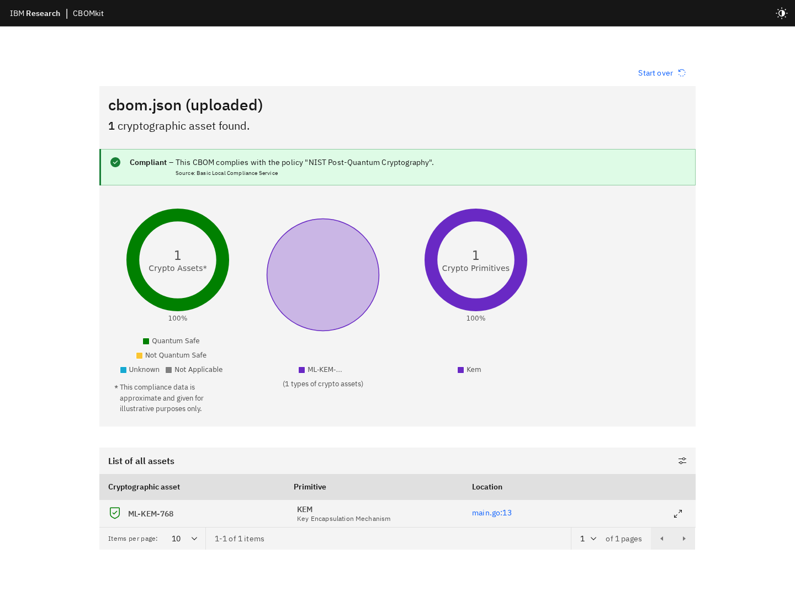

# CBOM Lab Results Overview

> IBM/PQCA CBOM 생태계의 주요 도구를 같은 Java·Python·Go·인증서·TLS fixture에 적용한 결과를 한눈에 보는 요약 문서다. 상세 근거는 [통합 기능 명세서](CBOM_%ED%86%B5%ED%95%A9_%EA%B8%B0%EB%8A%A5_%EB%AA%85%EC%84%B8%EC%84%9C.md)와 [실행 원장](CBOM_LAB_PLAN.md)에 있다.

## 1. 실험 흐름

```text
Java·Python·Go source ── Sonar / CBOMkit-action ─┐
certificate·key·TLS ─── CBOMkit-theia ──────────┼─ CBOM JSON
container / OCI image ─ CBOMkit-theia ──────────┘      │
                                                       ▼
                                      CBOMkit API·DB·Viewer
                                                       │
                                      Built-in / coeus / OPA policy
```

도구마다 분석 대상과 component 병합 기준이 다르므로 component 개수만으로 성능을 비교하면 안 된다. 소스 탐지, 파일·이미지 탐지, 저장·시각화, 정책 평가는 서로 다른 계층이다.

## 2. 핵심 결과

| 실험 | 결과 | 판단 |
|---|---:|---|
| IBM/CycloneDX schema | 14/14 기대 일치 | 정상·음성 fixture 모두 성공 |
| Semantic positive validation | 13/13 | 참조 무결성 정상 |
| 실제 ML-KEM-768 source | 1 component, 1 occurrence | round-trip·scanner·policy·Viewer 모두 성공 |
| Sonar source scan | 38 components, 23 dependencies, 32 issues | Java·Python·Go family 22/22 탐지 |
| CBOMkit-action local | 49 components, 24 dependencies | 3개 언어 module과 통합 CBOM 생성 |
| GitHub-hosted Action | 41 components, 22 dependencies | workflow 성공, artifact 확보 |
| CBOMkit public Git scan | 48 components, 24 dependencies | Git clone·scan·PostgreSQL 저장 성공 |
| Theia directory scan | 25 components, 4 dependencies | 인증서·키·TLS 설정 탐지, filesystem 6/7 |
| Theia `alpine:3.22` scan | 2,858 components, 476 dependencies | registry image scan 성공 |
| Sonar→Theia enrichment | 38→64 components | 26개 추가, 기존 component 수정 0개 |
| 보완 전→후 Action | 49→44 components | MD5 3개와 CBC 2개 제거 확인 |
| Built-in compliance | golden fixture 5/5 | 기대 결과와 일치 |
| External OPA compliance | golden fixture 3/5 | ECDH enum과 ML-KEM 판정 충돌 발견 |
| CBOMkit release UI | full/coeus 정상 | release 2.2.0 사용 가능 |
| CBOMkit current UI | blank screen | Vue dependency 회귀 발견 |

## 3. `results/` 디렉터리 안내

| 디렉터리 | 무엇을 테스트했는가 | 대표 결과 |
|---|---|---|
| `results/sonar/` | SonarQube Cryptography Plugin의 3개 언어 소스 분석 | `cbom.json`, issue/API/scan log |
| `results/action/` | Action 엔진의 로컬·보완본·GitHub-hosted 실행 | module CBOM, 통합 CBOM, artifact와 workflow log |
| `results/theia-dir/` | 디렉터리의 인증서·키·OpenSSL/TLS 설정 분석 | CycloneDX 1.7 `cbom.json` |
| `results/theia-image/` | registry image, OCI amd64, multi-arch 경계 분석 | Alpine CBOM과 성공·실패 log |
| `results/enriched/` | Sonar CBOM에 Theia filesystem 결과 추가 | 64-component 통합 `cbom.json` |
| `results/theia-config/` | TLS 1.2→1.3 설정 변경 비교 | baseline/remediated CBOM |
| `results/remediated/` | MD5·AES-CBC를 제거한 fixture build/run | Java·Python·Go smoke 결과 |
| `results/remediated-theia/` | 보완된 디렉터리 재분석 | 보완본 Theia `cbom.json` |
| `results/cbomkit/` | REST API, DB, Git scan, CBOM 재조회·비교 | Git scan CBOM, API response, DB query log |
| `results/compliance/` | Built-in·coeus local·OPA 정책 평가 | 원시 policy response와 golden matrix |
| `results/quantum-safe/` | 실제 ML-KEM-768 실행·스캔·정책·공개 Viewer 검증 | Viewer용 CBOM, log, compliance와 browser 결과 |
| `results/ibm/` | IBM CBOM 1.0 schema 정상·음성 입력 | valid/invalid JSON fixture |
| `results/cyclonedx/` | JSON Schema와 semantic validation | 14-case schema, 13-case semantic 결과 |
| `results/ui/` | CBOMkit current/release full·coeus 화면 | browser validation과 build/audit 결과 |
| `results/diff/` | 비교 결과용 초기 위치 | 현재 비어 있으며 실제 비교는 관련 도구 폴더에 저장 |
| `results/environment/` | 환경 결과용 초기 위치 | 현재 비어 있으며 환경 근거는 원장과 `evidence/`에 저장 |

## 4. IBM Zurich Viewer에 넣을 JSON

[IBM Zurich CBOM Viewer](https://www.zurich.ibm.com/cbom/)는 소스나 Git URL을 직접 스캔하는 생성기가 아니라, 생성된 CBOM JSON을 시각화하는 viewer다.

| 권장 순서 | 파일 | 확인할 내용 |
|---:|---|---|
| 1 | [`results/quantum-safe/action/cbom.json`](results/quantum-safe/action/cbom.json) | ML-KEM-768 한 개와 녹색 `Quantum Safe` 100% 판정 |
| 2 | `results/sonar/cbom.json` | Java·Python·Go 암호 자산과 소스 occurrence |
| 3 | `results/action/github/artifact/cbom.json` | 실제 GitHub Actions에서 생성된 module 통합 결과 |
| 4 | `results/theia-dir/cbom.json` | 인증서·개인키·TLS protocol·cipher 설정 |
| 5 | `results/enriched/cbom.json` | source CBOM과 filesystem 자산을 결합한 결과 |
| 6 | `results/theia-image/alpine-3.22-cbom.json` | 컨테이너 내부 암호 자산; 2,858개라 렌더링이 느릴 수 있음 |

Quantum-safe 표시를 확인할 때는 `results/quantum-safe/action/cbom.json` 하나만 업로드하면 된다. 전체 source inventory부터 살펴볼 때는 `results/sonar/cbom.json`을 사용한다. `schema-validation.json`, compliance response, workflow metadata와 log는 CBOM 문서가 아니므로 Viewer 입력으로 사용하지 않는다.



## 5. 주요 발견 사항

- Sonar는 같은 알고리즘의 여러 occurrence를 비교적 많이 병합하지만 Action은 언어별 component를 더 많이 유지한다. 따라서 38 대 49라는 차이는 곧 정확도 차이가 아니다.
- Theia는 소스 호출보다 인증서·키·설정·image filesystem 자산에 적합하다. 독립 public key 하나는 누락했다.
- Enrichment는 자산 26개를 추가했지만 Java security 제한 metadata를 기존 component에 반영하지 못했고, secret 오탐 component 하나는 `bom-ref`가 없었다.
- Theia multi-arch OCI 실패는 exit code 0을 반환해 CI에서 거짓 성공이 될 수 있다.
- GitHub Action 성공만으로 모든 module이 정상 분석됐다고 볼 수 없다. 실제 artifact에 비어 있는 보완 Java module이 있었다.
- Built-in policy는 실험 fixture와 일치했지만 OPA sample policy는 `key-agree` 표기와 ML-KEM 이름 처리에서 충돌했다.
- 별도 Go fixture는 ML-KEM-768 캡슐화·역캡슐화를 실제 수행했고, scanner가 `main.go:13`에서 이를 탐지해 공개 Viewer에서 `Quantum Safe`로 표시했다.
- Schema 통과는 필드 형식이 맞다는 뜻이며 dependency 참조와 정책 결과까지 정확하다는 뜻은 아니다.

## 6. 검증 범위와 제한

- Docker daemon 권한이 없어 lab Dockerfile 직접 build 대신 registry와 OCI 입력으로 image scan을 검증했다.
- 보완 전·후 Sonar 재스캔은 관리자 credential 유실로 제외하고 Action·Theia 결과로 비교했다.
- 공개 Git scan은 실행했지만 private repository credential 경로와 PURL scan은 실행하지 않았다.
- MD5, AES-CBC, 고정 key/IV와 인증서는 scanner 검증용이며 production 사용 예제가 아니다.
- 실제 ML-KEM 단독 실행은 검증했지만 기존 RSA 기반 protocol을 hybrid/PQC protocol로 마이그레이션한 것은 아니다.
- 실제 조직의 CBOM에는 소스 위치와 암호 구성 정보가 포함될 수 있으므로 공개 Viewer 업로드 전 민감정보를 검토해야 한다.

## 7. 관련 문서와 증거

- [통합 기능 명세서](CBOM_%ED%86%B5%ED%95%A9_%EA%B8%B0%EB%8A%A5_%EB%AA%85%EC%84%B8%EC%84%9C.md): 도구별 20개 항목과 상세 해석
- [실행 원장](CBOM_LAB_PLAN.md): revision, 명령, 우회 방법, 차단 사유
- [Ground truth](ground-truth.md): 실행 전에 고정한 기대 자산
- [캡처 manifest](evidence/CAPTURE_MANIFEST.md): 각 이미지가 증명하는 범위
- `evidence/`: 실제 실행 결과 및 웹 화면 캡처
